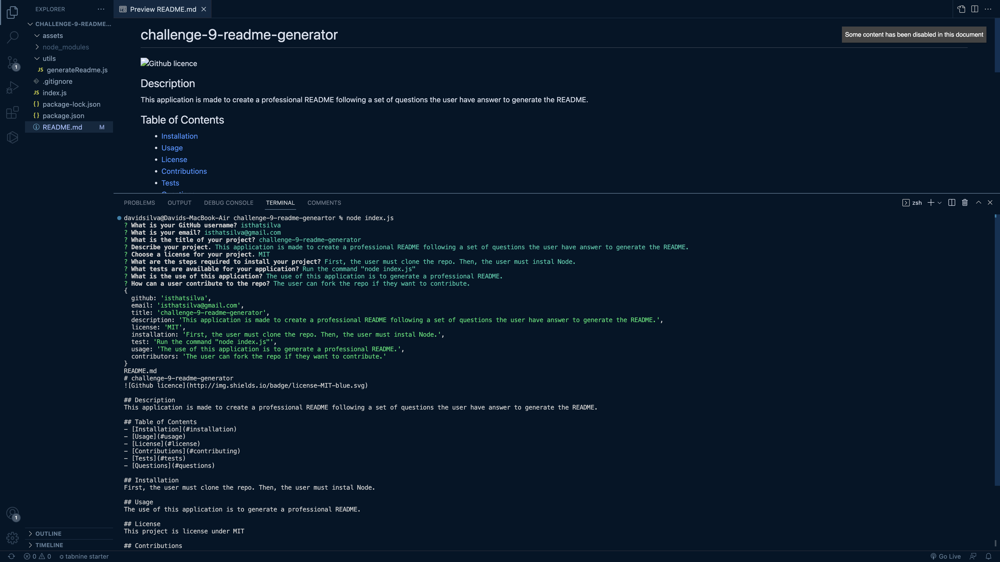

# challenge-9-readme-generator

        
## Description 
This application is made to create a professional README following a set of questions the user have answer to generate the README.

## Table of Contents
- [Installation](#installation)
- [Usage](#usage)
- [License](#license)
- [Contributions](#contributing)
- [Tests](#tests)
- [Questions](#questions)
        
## Installation 
First, the user must clone the repo. Then, the user must instal Node.

## Usage
The use of this application is to generate a professional README.

## License 
This project is license under MIT

## Contributions 
The user can fork the repo if they want to contribute.

## Tests
Run the command "node index.js"

## Questions
You can email me at isthatsilva@gmail.com. 
You can view more of my work at https://github.com/isthatsilva.

## Links
https://drive.google.com/file/d/1w2FkYgNWVgGApVoGzQROGHAPsVfr6nTl/view

